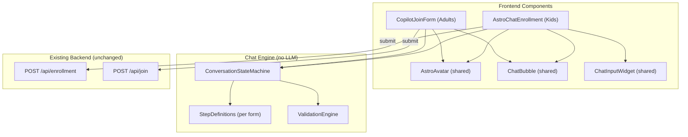

# AI-Centric Conversational Forms — Implementation Plan

**Project:** Madinaty AI Platform  
**Date:** 2026-05-10  
**Status:** Draft — Awaiting Feedback

---

## Table of Contents

1. [Overview](#1-overview)
2. [Architecture](#2-architecture)
3. [Flow A — Kids' Session: Typeform Chat + Astro Avatar](#3-flow-a--kids-session)
4. [Flow B — Main Platform: Side-by-Side Copilot](#4-flow-b--main-platform)
5. [Shared Infrastructure](#5-shared-infrastructure)
6. [AI Agent Prompt Design](#6-ai-agent-prompt-design)
7. [3D Avatar Strategy](#7-3d-avatar-strategy)
8. [i18n & RTL](#8-i18n--rtl)
9. [Phased Milestones](#9-phased-milestones)
10. [Open Questions](#10-open-questions)

---

## 1. Overview

### Goal
Replace the traditional `EnrollmentModal` (kids) and `JoinModal` (adults) with AI-driven conversational UIs that feel native to an AI platform.

### Two Distinct Flows

| Aspect | Kids (Flow A) | Adults (Flow B) |
|--------|--------------|-----------------|
| **Approach** | #3 — Typeform Chat | #1 — Side-by-Side Copilot |
| **Avatar** | Astro (robot dog) — prominent | Astro — smaller, sidebar |
| **Form visible?** | No — chat IS the form | Yes — real form on left, chat on right |
| **Input method** | Structured widgets inside chat bubbles | Dual: chat OR direct form typing |
| **Tone** | Playful, emoji-rich, encouraging | Professional, helpful, concise |
| **Existing component** | `EnrollmentModal.tsx` (758 lines) | `JoinModal.tsx` (342 lines) |
| **API endpoint** | `POST /api/enrollment` (unchanged) | `POST /api/join` (unchanged) |

### Design Principles

1. **No LLM dependency for core flow** — The chat is scripted/state-machine driven. No API calls to GPT/Gemini needed for the form itself. This keeps it fast, reliable, and free.
2. **Progressive disclosure** — One question at a time (kids) or AI highlights next empty field (adults).
3. **Escape hatch** — Users can always skip the chat and fill the form directly (adults) or use a "skip to form" link (kids).
4. **Same API contract** — Both flows submit the exact same payload to existing `/api/enrollment` and `/api/join` endpoints. Zero backend changes.

---

## 2. Architecture



### New Files to Create

```
src/components/conversational/
├── AstroAvatar.tsx            # 3D/animated avatar component
├── ChatBubble.tsx             # Message bubble (bot + user)
├── ChatInputWidget.tsx        # Dynamic input: text, select, checkbox, age-picker
├── ConversationEngine.ts      # State machine + step runner
├── steps/
│   ├── enrollmentSteps.ts     # Step definitions for kids enrollment
│   └── joinSteps.ts           # Step definitions for adult join
├── AstroChatEnrollment.tsx    # Flow A: full-screen chat modal (kids)
├── CopilotJoinForm.tsx        # Flow B: split-screen copilot (adults)
└── conversational.css         # All styles for both flows
```

---

## 3. Flow A — Kids' Session: Typeform Chat + Astro Avatar

### UX Description

When a parent clicks **"Register Your Child"**, instead of the current form modal, a **full-screen overlay** appears:

- **Top/left**: Astro (animated robot dog) with idle animations (tail wag, head tilt, blinking)
- **Center**: Chat thread — Astro's messages appear as bubbles on the left, user responses on the right
- **Bottom**: Dynamic input area that changes per step (text field, button grid, number stepper, checkbox grid)

### Conversation Flow (13 steps)

| Step | Astro Says (EN) | Input Widget | Field Mapped |
|------|-----------------|--------------|--------------|
| 0 | "Woof! 🐕 I'm Astro, your AI buddy! Let's sign you up for the coolest AI adventure! What's the student's name?" | Text input | `childName` |
| 1 | "Nice to meet you, {childName}! 🎉 How old are you?" | Number stepper (7–10) | `childAge` |
| 2 | "Awesome! Are you a..." | Two large buttons: Boy / Girl | `childGender` |
| 3 | "What grade are you in?" | Button grid (Grade 1–5) | `childGrade` |
| 4 | "What school do you go to?" | Text input | `schoolName` |
| 5 | "What AI topics sound cool to you? Pick as many as you want! 🤖" | Checkbox cards with icons | `interests[]` |
| 6 | "What do you like doing for fun?" | Text input with emoji suggestions | `hobbies` |
| 7 | "Great choices! Now I need to talk to your parent for a sec 👋 What's your parent's name?" | Text input | `parentName` |
| 8 | "Thanks! What's their national ID? (14 digits)" | Numeric input with digit counter | `parentNationalId` |
| 9 | "And their phone number?" | Tel input | `phone` |
| 10 | "Almost done! Parent's email?" | Email input | `email` |
| 11 | "Where do you live in Madinaty?" | Two cascading selects: Type → Area | `addressType` + `addressArea` |
| 12 | **Review card** — Shows all data in a summary card. "Everything look good? 🚀" | "Submit" / "Edit" buttons | — |

### Astro Reactions

- **On each answer**: Astro plays a short reaction animation (nod, tail wag, sparkle eyes)
- **On validation error**: Astro shakes head, shows error bubble: "Hmm, that doesn't look right. Try again!"
- **On submit success**: Astro does a celebration animation (jump + confetti), shows registration number
- **On submit error**: Astro looks worried, suggests retry

### Key UX Details

- **Progress bar** at top showing step X/12
- **"Back" button** to revisit previous step (previous answer shown in chat, editable)
- **"Skip to form" link** at bottom for parents who prefer traditional input
- **Auto-scroll** to latest message with smooth animation
- **Typing indicator** before Astro's message appears (300ms delay for realism)

---

## 4. Flow B — Main Platform: Side-by-Side Copilot

### UX Description

When a user clicks **"Join the Initiative"**, a modal opens with a **split layout**:

| Left Side (60%) | Right Side (40%) |
|-----------------|------------------|
| Clean, modern form (same fields as `JoinModal`) | Astro avatar (smaller) + chat panel |
| Fields highlight as AI suggests them | AI greets user and guides through fields |
| Direct typing works independently | Chat reacts to form changes in real-time |

### Copilot Behavior

1. **On open**: Astro says "Hi! I'll help you join Madinaty AI. Start typing your name, or just tell me and I'll fill it in! 👋"
2. **As user types in form fields**: Astro reacts with encouraging micro-messages:
   - Name filled → "Nice to meet you, {name}! 😊"
   - Email filled → "Got it! ✅"
   - All fields done → "You're all set! Hit Submit whenever you're ready 🚀"
3. **If user types in chat instead**: The engine parses the message, fills matching form fields with animation (glow + auto-type effect), and Astro confirms: "I've filled that in for you!"
4. **Field highlighting**: The copilot highlights the next empty required field with a pulsing border
5. **Validation**: If user tries to submit with errors, Astro points out the specific problem: "Looks like the email isn't quite right — mind checking it?"

### Chat-to-Form Mapping (Simple keyword matching, no LLM)

The copilot uses simple pattern matching for chat input:

```typescript
// Example: User types "My name is Ahmed and my email is ahmed@gmail.com"
// Engine extracts:
//   - name pattern: /(?:name\s+is|i'm|i am|اسمي)\s+(.+?)(?:\s+and|\s+و|$)/i
//   - email pattern: /[\w.-]+@[\w.-]+\.\w+/
// Maps to: { name: "Ahmed", email: "ahmed@gmail.com" }
```

> [!NOTE]
> This is intentionally simple regex/keyword matching — NOT an LLM call. It handles common patterns and gracefully falls back to asking for clarification if parsing fails. The user can always just type directly in the form.

---

## 5. Shared Infrastructure

### ConversationEngine (State Machine)

```typescript
interface ConversationStep {
  id: string;
  field: string | string[];           // form field(s) this step fills
  botMessage: (ctx: FormState, locale: LocaleCode) => string;
  inputType: 'text' | 'number' | 'select' | 'multi-select' | 'tel' | 'email' | 'cascading-select' | 'review';
  inputProps?: Record<string, unknown>; // min, max, options, placeholder, etc.
  validate: (value: unknown) => { valid: boolean; error?: string };
  onAnswer?: (value: unknown, ctx: FormState) => Partial<FormState>; // transform before storing
}

interface ConversationState {
  currentStep: number;
  formData: Record<string, unknown>;
  messages: ChatMessage[];
  status: 'chatting' | 'reviewing' | 'submitting' | 'success' | 'error';
}
```

### ChatBubble Component

- **Bot bubble**: Avatar icon + message + optional "typing" animation
- **User bubble**: Right-aligned, shows the user's answer in human-readable form
- **Widget bubble**: Special bubble that contains the input widget (rendered inline in the chat)

### AstroAvatar Component

See [Section 7](#7-3d-avatar-strategy) for the full avatar strategy.

---

## 6. AI Agent Prompt Design

### Kids Flow — Astro's Personality Prompt

```
You are Astro, a friendly robot dog mascot for Madinaty AI's kids program.

PERSONALITY:
- Enthusiastic, warm, encouraging — like a smart puppy who loves learning
- Use simple language (target: 7-10 year old comprehension)
- Sprinkle in emojis (🐕 🎉 🚀 🤖 ⭐) but don't overdo it (max 2 per message)
- Celebrate every answer: "Awesome!", "Great choice!", "You're doing amazing!"
- On errors, be gentle: "Oops! Let's try that again" (never "Wrong" or "Invalid")

CONVERSATION RULES:
- Ask ONE question per message. Never combine questions.
- Keep messages under 30 words (kids lose attention fast).
- Use the child's name after learning it (creates connection).
- When transitioning from child to parent questions (step 7), clearly signal:
  "Now I need your parent/guardian to help with a few things! 👋"
- On review step, present data in a fun "mission briefing" format.
- After submission, give a "mission code" (registration number) and celebrate.

LOCALE BEHAVIOR:
- Arabic (ar): Use Modern Standard Arabic accessible to children. Use RTL punctuation.
  Tone should be playful but respectful (Egyptian dialect touches are OK for warmth).
- English (en): Simple, conversational American English.

NEVER:
- Ask for information not in the form fields.
- Make promises about session dates/times.
- Provide AI advice or answer unrelated questions.
- Use complex words or jargon.
```

### Adults Flow — Copilot Personality Prompt

```
You are Astro, the AI assistant for Madinaty AI platform registration.

PERSONALITY:
- Professional but approachable — like a helpful concierge
- Concise — max 20 words per message unless explaining an error
- Use minimal emoji (max 1 per message, professional ones: ✅ 👋 🚀)
- Don't over-celebrate. A simple "Got it!" or "✅" is enough per field.

COPILOT RULES:
- You OBSERVE the form state. When a field is filled, acknowledge briefly.
- If the user types in chat, try to extract form data using pattern matching.
- If extraction fails, ask for clarification: "I didn't catch that. Which field were you filling?"
- Highlight the next empty required field: "Next up: your phone number"
- On validation errors during submit, be specific: "The email format looks off — it should be like name@example.com"
- When all fields are valid, prompt: "Everything looks good! Ready to submit? 🚀"

LOCALE BEHAVIOR:
- Arabic (ar): Professional Modern Standard Arabic. Formal but not stiff.
- English (en): Clean, professional English.

NEVER:
- Auto-submit the form. Always let the user click Submit.
- Fill sensitive fields (national ID, phone) without explicit user input.
- Provide information outside the registration scope.
```

---

## 7. 3D Avatar Strategy

### Recommended Approach: Animated SVG/Lottie (Phase 1) → 3D Model (Phase 2)

> [!IMPORTANT]
> Starting with full 3D (Three.js/React Three Fiber) adds significant bundle size (~200KB+) and complexity. I recommend a phased approach.

### Phase 1: Animated 2D Avatar (Week 1-2)

- **Technology**: Lottie animations (via `lottie-react`) or CSS sprite-based animation
- **Bundle impact**: ~15KB for lottie-react + ~50KB for animation JSON
- **Avatar states** (each is a separate Lottie/CSS animation):

| State | Animation | Trigger |
|-------|-----------|---------|
| `idle` | Tail wag, subtle breathing, blinking | Default |
| `talking` | Mouth moves, head bobs | While bot message appears |
| `listening` | Head tilted, ears perked | While user is typing |
| `celebrating` | Jump + sparkles | On successful submission |
| `thinking` | Spinning gear near head | During submit/loading |
| `error` | Head shake, worried eyes | On validation error |
| `waving` | Paw wave | On greeting / goodbye |

### Phase 2: 3D Model (Week 4+, optional)

- **Technology**: React Three Fiber + `@react-three/drei`
- **Model**: Low-poly robot dog (.glb, target <500KB)
- **Rendering**: Canvas element with transparent background, overlaid on chat
- **Fallback**: Auto-detect WebGL support; fall back to Phase 1 Lottie if unsupported
- **Mobile**: Use static image + CSS transitions on low-power devices

### Decision Point for You

> [!WARNING]
> Do you have an existing Astro robot dog asset (3D model, Lottie, or illustration set)? If not, we need to either:
> 1. Generate one using AI image tools + animate with CSS/Lottie
> 2. Commission/find a low-poly 3D model
> 3. Use a stylized 2D illustration with CSS animations (fastest path)

---

## 8. i18n & RTL

Both flows must support Arabic (RTL) and English (LTR) seamlessly.

| Element | LTR (English) | RTL (Arabic) |
|---------|---------------|--------------|
| Chat layout | Bot bubbles left, user right | Bot bubbles right, user left |
| Avatar position | Left side | Right side |
| Copilot split | Form left, chat right | Form right, chat left |
| Progress bar | Left to right fill | Right to left fill |
| Input alignment | Left-aligned text | Right-aligned text |
| Number inputs | Standard digits | Arabic-Indic digits accepted, stored as Latin |

All bot messages are defined as bilingual objects in the step definitions — no runtime translation needed:

```typescript
const step: ConversationStep = {
  id: 'childName',
  botMessage: (ctx, locale) => locale === 'ar'
    ? 'هاو! 🐕 أنا أسترو، صديقك الذكي! إيه اسم الطالب؟'
    : "Woof! 🐕 I'm Astro, your AI buddy! What's the student's name?",
  // ...
};
```

---

## 9. Phased Milestones

### Phase 1: Foundation (3-4 days)
- [ ] Create `ConversationEngine.ts` state machine
- [ ] Create `ChatBubble.tsx`, `ChatInputWidget.tsx` shared components
- [ ] Create `enrollmentSteps.ts` and `joinSteps.ts` step definitions
- [ ] Create `AstroAvatar.tsx` with CSS-animated placeholder (simple robot face)
- [ ] Basic styling in `conversational.css`

### Phase 2: Kids Flow — AstroChatEnrollment (3-4 days)
- [ ] Build `AstroChatEnrollment.tsx` full-screen chat modal
- [ ] Wire all 13 steps with validation
- [ ] Add progress bar, back navigation, review card
- [ ] Connect to existing `POST /api/enrollment` endpoint
- [ ] Add success celebration screen with registration number
- [ ] Add "Skip to classic form" fallback link
- [ ] Full AR/EN i18n for all messages

### Phase 3: Adults Flow — CopilotJoinForm (3-4 days)
- [ ] Build `CopilotJoinForm.tsx` split-screen modal
- [ ] Implement form ↔ chat sync (typing in form updates chat, typing in chat fills form)
- [ ] Add simple pattern-matching chat parser
- [ ] Add field highlighting (next empty field pulse)
- [ ] Connect to existing `POST /api/join` endpoint
- [ ] Full AR/EN i18n

### Phase 4: Avatar & Polish (2-3 days)
- [ ] Create or source Astro avatar asset (Lottie/SVG/illustration)
- [ ] Implement animation states (idle, talking, celebrating, error)
- [ ] Add micro-animations: typing indicator, bubble entrance, field glow
- [ ] Mobile responsive testing & fixes
- [ ] Accessibility audit (keyboard nav, screen reader, focus management)
- [ ] Performance check (bundle size, animation FPS)

### Phase 5: Integration & Cutover (1-2 days)
- [ ] Replace `EnrollmentModal` references with `AstroChatEnrollment` in `ComingSoonPage.tsx`
- [ ] Replace `JoinModal` references with `CopilotJoinForm` in `LandingPage.tsx`
- [ ] Keep old components as fallback (feature flag or "classic mode" link)
- [ ] End-to-end testing: submit → Google Sheet → confirmation email
- [ ] Cross-browser testing (Chrome, Safari, Firefox, mobile)

**Total estimated time: 12-17 days**

---

## 10. Open Questions

> [!IMPORTANT]
> These need your input before implementation begins:

1. **Astro Avatar Asset** — Do you have an existing robot dog illustration/model, or should I generate one? What style do you prefer? (cute/cartoonish vs. sleek/futuristic)

2. **Feature Flag or Hard Replace?** — Should we keep the old forms accessible via a toggle/link, or fully replace them from day one?

3. **Sound Effects** — Should Astro have subtle sound effects (typing clicks, celebration chime, woof on greeting)? Kids would love it, but it needs a mute button.

4. **Chat-to-Form NLP (Adults)** — The current plan uses simple regex. Should we integrate Gemini API (you already have `@google/generative-ai` in dependencies) for smarter natural language parsing in the adult copilot? This adds latency and API cost but improves the "wow" factor.

5. **Priority** — Which flow should we build first? I'd recommend Kids (Flow A) since it's self-contained and higher impact for the upcoming event.

6. **3D vs 2D Timeline** — Are you okay starting with animated 2D (Lottie/CSS) and upgrading to 3D later, or is 3D a hard requirement for launch?
